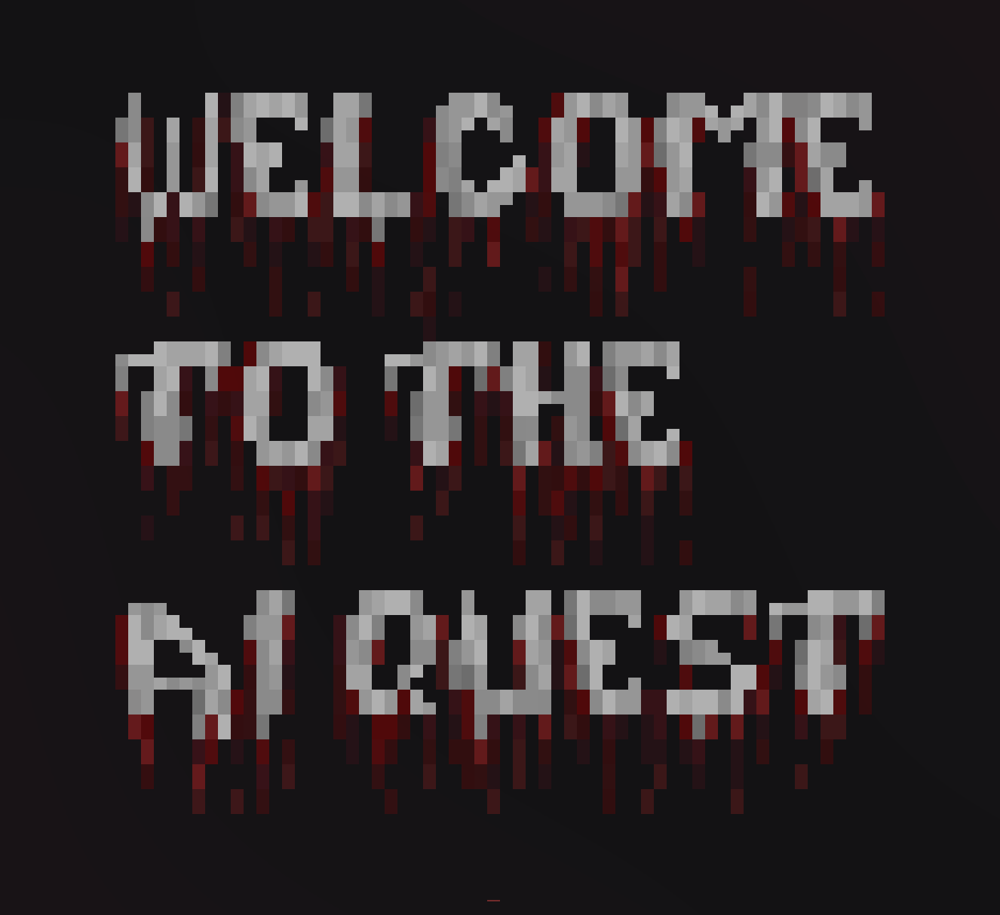
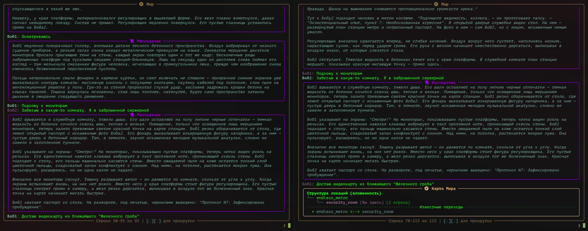

<div align="center">

# AI-Quest

### Текстовая RPG с Искусственным Интеллектом.

<p>
    <a href="https://www.python.org/downloads/"></a>
    <a href="https://github.com/roberttkach/ai-quest/blob/main/LICENSE"></a>
    <a href="https://github.com/roberttkach/ai-quest/pulls"></a>
    <a href="https://github.com/roberttkach/ai-quest/issues"></a>
    <br>
    
</p>

</div>

---

<div align="center">



</div>

## Ключевые особенности

*   **Динамический сюжет**: Повествование генерируется LLM (Deepseek) в реальном времени, что обеспечивает уникальность каждой игровой сессии.
*   **Интерактивный мир**: ИИ управляет состоянием игрового мира: создает и изменяет локации, добавляет предметы в инвентарь и применяет эффекты в зависимости от действий игрока.
*   **Многопользовательский режим**: Поддержка совместной игры. Действия каждого игрока влияют на общий мир.
*   **Терминальный интерфейс (TUI)**: Клиентская часть использует библиотеку `rich` для создания удобного и визуально приятного интерфейса в терминале.
*   **Асинхронная архитектура**: Проект полностью построен на базе `trio`, что обеспечивает высокую производительность и отзывчивость как на стороне сервера, так и на стороне клиента.
*   **Система промптов**: Для повышения качества генерации и следования заданной атмосфере, сервер использует систему промптов, включающую набор "режиссерских принципов".



## Быстрый старт

```bash
# 1. Клонировать репозиторий
git clone https://github.com/roberttkach/ai-quest.git
cd ai-quest

# 2. Создать и активировать виртуальное окружение
python3 -m venv venv
source venv/bin/activate

# 3. Установить зависимости
pip install -r requirements.txt

# 4. Добавить API ключ в .env файл
echo 'DEEPSEEK_API_KEY="sk-..."' > .env

# 5. Запустить сервер
python server/main.py

# 6. В новом терминале запустить клиент
python client/main.py
```

## Инструкция по установке

### Шаг 0: Предварительные требования
*   **Ключ API**: Необходим аккаунт [Deepseek](https://platform.deepseek.com/) и действительный API ключ.
*   **Терминал**: Командная строка (например, Bash, Zsh, PowerShell).

### Шаг 1: Установка Python и Git

<details>
<summary><b>Windows</b></summary>

1.  **Установите Chocolatey** (если не установлен). Откройте PowerShell **от имени администратора** и выполните:
    ```powershell
    Set-ExecutionPolicy Bypass -Scope Process -Force; [System.Net.ServicePointManager]::SecurityProtocol = [System.Net.ServicePointManager]::SecurityProtocol -bor 3072; iex ((New-Object System.Net.WebClient).DownloadString('https://community.chocolatey.org/install.ps1'))
    ```
2.  **Установите Python и Git**:
    ```powershell
    choco install python git -y
    ```
3.  **Проверьте установку**, перезапустив терминал:
    ```bash
    python --version
    git --version
    ```

</details>

<details>
<summary><b>MacOS</b></summary>

1.  **Установите Homebrew** (если не установлен). Откройте Терминал и выполните:
    ```bash
    /bin/bash -c "$(curl -fsSL https://raw.githubusercontent.com/Homebrew/install/HEAD/install.sh)"
    ```
2.  **Установите Python и Git**:
    ```bash
    brew install python git
    ```
3.  **Проверьте установку**:
    ```bash
    python3 --version
    git --version
    ```
</details>

<details>
<summary><b>Linux</b></summary>

1.  **Установите пакеты** с помощью менеджера пакетов вашего дистрибутива (пример для Debian/Ubuntu):
    ```bash
    sudo apt update && sudo apt install python3-venv python3-pip git -y
    ```
2.  **Проверьте установку**:
    ```bash
    python3 --version
    git --version
    ```
</details>

### Шаг 2: Настройка проекта

1.  **Клонируйте репозиторий** и перейдите в директорию проекта:
    ```bash
    git clone https://github.com/roberttkach/ai-quest.git
    cd ai-quest
    ```
2.  **Создайте и активируйте виртуальное окружение**:
    ```bash
    # Linux/macOS
    python3 -m venv venv
    source venv/bin/activate

    # Windows
    py -m venv venv
    venv\Scripts\activate
    ```
3.  **Установите зависимости**:
    ```bash
    pip install -r requirements.txt
    ```
4.  **Настройте API ключ**. Создайте файл `.env` в корневой директории проекта и добавьте в него свой ключ:
    ```env
    DEEPSEEK_API_KEY="sk-xxxxxxxxxxxxxxxxxxxxxxxx"
    ```

## Запуск и использование

1.  **Запустите сервер**. В терминале с активированным виртуальным окружением выполните:
    ```bash
    python server/main.py
    ```
    Сервер выведет в консоль свой IP-адрес и порт. Не закрывайте это окно.

2.  **Запустите клиент(ы)**. Откройте новый терминал для каждого игрока, активируйте виртуальное окружение и выполните:
    ```bash
    python client/main.py
    ```
    Клиент запросит IP-адрес и порт сервера. Для локального запуска используйте `127.0.0.1` и порт, указанный сервером.

3.  **Начните игру**. После подключения всех игроков, вернитесь в окно сервера и введите команду `/start`.

## Как внести вклад

Проект находится на ранней стадии разработки, и мы будем рады любой помощи.

*   **Нашли ошибку?** Пожалуйста, создайте [Issue](https://github.com/roberttkach/ai-quest/issues).
*   **Есть предложение?** Мы также отслеживаем их в [Issues](https://github.com/roberttkach/ai-quest/issues).
*   **Хотите предложить код?**
    1.  Сделайте форк репозитория.
    2.  Создайте новую ветку (`git checkout -b feature/новая-фича`).
    3.  Внесите изменения и сделайте коммит.
    4.  Отправьте Pull Request.

## Лицензия

Этот проект распространяется под лицензией **MIT**. Подробности смотрите в файле `LICENSE`.

